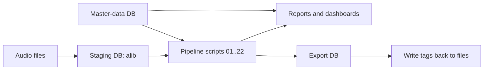

# Tagminder

Tagminder is a local-first metadata workflow for large audio libraries.

It imports tags from your music files into a staging SQLite database, runs a numbered cleanup and enrichment pipeline against that database, records every field-level change, and exports tags back to files only at the end of the workflow.

The design goal is simple: make metadata cleanup repeatable, inspectable, and safe at scale.

## Documentation Map

Use these documents in this order:

1. [README.md](README.md): quick orientation, safety model, and first-run quickstart.
2. [docs/user-guide.md](docs/user-guide.md): full workflow guide (first run, routine runs, enrichment, export, troubleshooting).
3. [scripts/mdm/harvest/README.md](scripts/mdm/harvest/README.md): MusicBrainz/master-data setup and harvest workflow.
4. [docs/emit_contributors.README.md](docs/emit_contributors.README.md): contributor emit pipeline details.

If you are new, read README once, then work primarily from the user guide.

## What Tagminder Is

Tagminder is not a streaming service client, a player, or a one-click retagger.

It is:

- a database-first tagging workflow
- a set of auditable scripts for cleaning and enriching library metadata
- a reporting layer for understanding library quality before writing anything back to files
- an optional MusicBrainz-aware enrichment stack when you provide master/reference data

## Architecture

Tagminder operates with three distinct data layers:

1. Audio files
2. Staging database
3. Master-data database

The staging database is where your library is imported and transformed. The master-data database holds harvested/reference data used for enrichment, such as MusicBrainz works, contributors, namesakes, and curated mappings.



### Core Tables

- `alib`: one row per audio file in the staging database - this table contains the audio metadata related to all audio files ingested into TagMinder
- `changelog`: field-level audit trail of metadata changes made by TagMinder Scripts and/or users editing the alib table directly
- `work_inference_candidates`: machine-generated suggestions for possible work associations. Think of this as a review queue (draft proposals), not final truth.
- `user_vetted_works`: your accepted/canonical work associations after review. Think of this as the trusted decisions table that future runs should honor.

### Safety Model

- Importing and pipeline processing do not write to audio files.
- Pipeline scripts mutate the staging database.
- Export is a separate explicit step.
- File/folder renaming is a separate script and dry-run by default.

## Repository Layout

The repo is structured by function:

- [src/tagminder/app](src/tagminder/app): app entrypoints (`tm`, `tm-cli`, TUI)
- [src/tagminder/core](src/tagminder/core): shared SQLite, changelog, config, Polars, and utility helpers
- [scripts/ingest](scripts/ingest): import/export tooling
- [scripts/pipeline](scripts/pipeline): numbered staging-database transformation steps
- [scripts/reports](scripts/reports): dashboards and diagnostics
- [scripts/snapshots](scripts/snapshots): before/after health snapshots
- [scripts/export](scripts/export): export DB builder, reset helpers, path rename tooling
- [scripts/mdm/harvest](scripts/mdm/harvest): master-data harvesters and MusicBrainz work lookup builders
- [docs](docs): focused supporting documentation

## Requirements

- Python 3.14+
- `uv`

The repo pins its Python version in [.python-version](.python-version).

Install the correct interpreter and dependencies:

```bash
uv python install 3.14
uv sync
```

Run commands from the repository root unless a script explicitly says otherwise.

## Beginner Path (30 Minutes)

If you are new to command-line tools, start here.

This path is designed to be safe:

- nothing writes back to audio files until you explicitly run export
- you can inspect results before any file mutation

Use a small test folder first (for example, 200 to 2000 tracks).

### Step 1: Configure dependencies

```bash
uv python install 3.14
uv sync
```

### Step 2: Set your three database paths in `tagminder.toml`

- `[db].path`
- `[master_data].path`
- `[export].db_path`

If you are not using MusicBrainz master data yet, you can still run Tagminder. Enrichment steps will warn or skip as needed.

### Step 3: Import your test library

```bash
uv run python scripts/ingest/tags2db.py import /music
```

### Step 4: Run a minimal cleanup subset

```bash
uv run python scripts/pipeline/02-clean-text-fields.py
uv run python scripts/pipeline/03-normalize-title-artist-features.py
uv run python scripts/pipeline/13-cleanup-discnumber.py
```

### Step 5: Generate health reports

```bash
uv run python scripts/reports/92-report-library-health.py
uv run python scripts/reports/93-report-track-sequence-anomalies-by-album.py
```

### Step 6: Build export DB only when results look right

```bash
uv run python scripts/export/98-create-export-db.py
```

Do not export to files until you are satisfied with the staging results.

Continue in User Guide: [First Run Workflow](docs/user-guide.md#first-run-workflow)

## What Success Looks Like

Use this table as your first-run checklist.

| Checkpoint | What you run | What you should see |
|---|---|---|
| Dependencies ready | `uv sync` | Command completes without dependency errors. |
| Import complete | `tags2db.py import ...` | A non-zero row count in `alib`; import summary in terminal. |
| Pipeline changes applied | steps 02/03/13 | Logs showing modified rows and changelog entries. |
| Reports generated | report scripts | New rows in `_INF_*` report tables and HTML output in `[paths].cache_dir`. |
| Export DB built | `98-create-export-db.py` | Export DB exists and contains export-ready rows. |

## First-Time Setup

### Recommended defaults (minimal starter config)

Use this as a baseline while learning Tagminder. Adjust paths to your machine.

```toml
[db]
path = "/tmp/tagminder-staging.db"

[master_data]
path = "/tmp/tagminder-master.db"

[export]
db_path = "/tmp/tagminder-export.db"

[paths]
cache_dir = "/tmp/tagminder-cache"

[strings]
multivalue_delimiter = "\\\\"
```

Why these defaults help:

- keeps staging, master data, and export clearly separated
- makes it easy to reset test runs without touching your music files
- keeps report output in one predictable folder

### 1. Review `tagminder.toml`

[tagminder.toml](tagminder.toml) controls the normal Tagminder workflow.

At minimum, first-time users should review:

- `[db].path`: staging database path
- `[master_data].path`: master-data/reference database path
- `[export].db_path`: export database path
- `[cleanup].keep_columns`: allowlist for the final cleanup step
- `[paths].cache_dir`: HTML dashboard/report output directory

Important distinction:

- `[columns].schema_columns` defines the canonical staging schema/order
- `[cleanup].keep_columns` defines which non-system fields survive the final cleanup step

If you do not understand those two sections, stop and read their comments in [tagminder.toml](tagminder.toml) before running step 01. They control what data persists in `alib`.

### 2. Optional: configure MusicBrainz master data

If you want contributor/MBID/work enrichment, review [harvest_master_data.toml](harvest_master_data.toml).

At minimum:

- `[musicbrainz].dump_archive`
- `[musicbrainz].contributors_db`

The master-data harvest workflow is documented in [scripts/mdm/harvest/README.md](scripts/mdm/harvest/README.md).

Continue in User Guide: [First Run Workflow](docs/user-guide.md#first-run-workflow) and [Enrichment Workflow](docs/user-guide.md#enrichment-workflow)

## Quickstart

This is the shortest safe end-to-end workflow for a new user.

### 1. Import your library into the staging DB

```bash
uv run python scripts/ingest/tags2db.py import /music
```

If you want to override the default DB path from [tagminder.toml](tagminder.toml):

```bash
uv run python scripts/ingest/tags2db.py import --db /tmp/tagminder-staging.db /music
```

Useful import modes:

- `--new-files`: import only files not already in `alib`
- `--modified-files`: import only changed files
- `--prunedb`: remove rows for files no longer on disk

Importing from multiple physical drives concurrently:

Tagminder can ingest multiple music directories in one run, and will process active drives concurrently.

Examples:

```bash
uv run python scripts/ingest/tags2db.py import /mnt/music_drive_1 /mnt/music_drive_2 /mnt/music_drive_3
```

```bash
uv run python scripts/ingest/tags2db.py import --db /tmp/tagminder-staging.db /mnt/music_drive_1 /mnt/music_drive_2
```

When multiple drives are supplied:

- `--workers` is applied per drive, not globally.
- Effective parallel workers are approximately `active_drives x workers_per_drive`.
- If `--workers` is omitted, Tagminder auto-calculates workers per drive as `cpu_count // active_drives`.
- Tagminder does not verify that sources are on different physical devices. If you pass multiple source paths from the same device, you will increase seek contention (disk thrashing), stress the drive, and slow ingestion.

Performance tuning (import only):

These options apply to `tags2db.py import` and control how aggressively Tagminder scans files and writes rows into `alib`.

- `--chunk-size`: number of files each worker processes per batch.
  - Higher values usually improve throughput by reducing coordination overhead.
  - Too high can increase memory usage and make progress feel bursty.
- `--workers`: number of parallel worker processes per drive.
  - More workers can improve speed when storage can sustain concurrent reads.
  - Too many workers can cause disk thrashing (constant random seek/read contention), which slows everything down.
  - In multi-drive ingest, total parallelism scales by number of active drives.

How to avoid disk thrashing:

- If disk activity is pegged but import speed drops, reduce `--workers` first.
- Prefer fewer workers on spinning disks (HDD), more on SSD/NVMe.
- Increase `--chunk-size` gradually only after worker count is stable.
- For multi-drive runs, reduce `--workers` per drive first before reducing `--chunk-size`.
- If all drives are busy and UI responsiveness drops, lower workers or ingest fewer drives per run.

Practical starting points:

- HDD: `--workers 2-4`, `--chunk-size 500-2000`
- SATA SSD: `--workers 4-8`, `--chunk-size 1000-5000`
- NVMe SSD: `--workers 8-16`, `--chunk-size 2000-8000`

Tune one parameter at a time, then compare rows-per-minute and system responsiveness.

Quick auto-tune playbook (copy/paste):

Use this first-profile shortcut: start with step 1 as written for HDD, or start with step 2 for SSD/NVMe.

1. Start conservative.

```bash
uv run python scripts/ingest/tags2db.py import --db /tmp/tagminder-staging.db /music --chunk-size 1000 --workers 4
```

2. Increase workers only.

```bash
uv run python scripts/ingest/tags2db.py import --db /tmp/tagminder-staging.db /music --chunk-size 1000 --workers 8
```

3. Keep workers, increase chunk size.

```bash
uv run python scripts/ingest/tags2db.py import --db /tmp/tagminder-staging.db /music --chunk-size 3000 --workers 8
```

Pick the best profile by this rule:

- fastest run that keeps the system responsive
- no sustained 100% disk usage with falling import throughput
- no excessive memory pressure or swap activity

Examples:

```bash
uv run python scripts/ingest/tags2db.py import --db /tmp/tagminder-staging.db /music --chunk-size 1000 --workers 4
uv run python scripts/ingest/tags2db.py import --db /tmp/tagminder-staging.db /music --chunk-size 5000 --workers 16
```

### 2. Inspect available scripts

Tagminder exposes two app entrypoints via [pyproject.toml](pyproject.toml):

- `tm`: launches the Textual TUI runner
- `tm-cli`: lists/describes/runs scripts from the terminal

Examples:

```bash
uv run tm-cli list
uv run tm-cli describe 22-infer-works-in-library.py
uv run tm
```

### 3. Run the numbered pipeline

You can either run scripts from the TUI/CLI, or invoke them directly.

Direct example:

```bash
uv run python scripts/pipeline/02-clean-text-fields.py --db /tmp/tagminder-staging.db
```

Most users should treat the numeric prefixes as the default order of operations.

### 4. Generate dashboards and diagnostics

The most useful first-pass reports are:

```bash
uv run python scripts/snapshots/90-snapshot-library-health-before.py --db /tmp/tagminder-staging.db
uv run python scripts/reports/92-library-insights.py --db /tmp/tagminder-staging.db --theme dark --persona auto
uv run python scripts/reports/92-report-library-health.py --db /tmp/tagminder-staging.db --theme dark
```

These write HTML into `[paths].cache_dir` from [tagminder.toml](tagminder.toml) and typically open automatically in your browser.

### 5. Review the database before export

Tagminder is easiest to understand if you inspect the staging DB directly in SQLiteStudio or DB Browser for SQLite.

Good first things to inspect:

- `alib`
- `changelog`
- `work_inference_candidates`
- `user_vetted_works`

Quick SQL example:

```sql
SELECT DISTINCT alib_column, old_value, new_value
FROM changelog
ORDER BY alib_column, old_value, new_value;
```

CLI equivalent:

```bash
sqlite3 /tmp/tagminder-staging.db "SELECT DISTINCT alib_column, old_value, new_value FROM changelog ORDER BY alib_column, old_value, new_value;"
```

### 6. Build an export DB

```bash
uv run python scripts/export/98-create-export-db.py --db /tmp/tagminder-staging.db
```

This creates a separate export database and leaves the staging DB untouched.

### 7. Export tags back to files

```bash
uv run python scripts/ingest/tags2db.py export --db /tmp/tagminder-export.db /music
```

Useful export option:

- `--touch-mtime preserve` (default)
- `--touch-mtime plus1`
- `--touch-mtime none`

Note: export is deliberately wired to write tags one file at a time (sequential writes), not parallel file writes. This is intentional for predictable behavior and safer file-level error handling.

### 8. Optional: reset modification markers after export

```bash
uv run python scripts/export/99-reset-sqlmodded.py --db /tmp/tagminder-staging.db
```

Continue in User Guide: [Routine Workflow](docs/user-guide.md#routine-workflow), [Import Performance Workflow](docs/user-guide.md#import-performance-workflow), and [Export Workflow](docs/user-guide.md#export-workflow)

## Recommended Operating Model

For most users, Tagminder works best with this repeatable cycle:

1. Import or refresh library rows into `alib`
2. Run a chosen subset of numbered pipeline steps
3. Generate health/snapshot reports
4. Inspect `changelog` and any review tables
5. Build export DB
6. Export back to files

That keeps file mutation explicit and bounded while letting the database absorb iterative cleanup work.

## Configuration Guide

### `tagminder.toml`

This is the main operational config for Tagminder.

Most important sections:

| Section | Purpose |
|---|---|
| `[db]` | staging DB path and core table names |
| `[master_data]` | reference/master-data DB path |
| `[export]` | export DB destination and table name |
| `[columns]` | canonical schema/order for `alib` |
| `[cleanup]` | retention allowlist and cleanup rules |
| `[strings]` | multi-value delimiter configuration |
| `[paths]` | cache/report output locations |
| `[reports.*]` | report-specific settings |
| `[scripts."..."]` | per-script behavior overrides |

Example of script-specific configuration currently in use:

- `[scripts."22-infer-works-in-library.py"]`
  - `auto_apply_requires_corroboration_for_title_only`
  - `auto_apply_requires_exact_workid_or_unique_exact_title`

### `harvest_master_data.toml`

This is only for master-data harvesting and readiness checks.

Use it when running scripts under [scripts/mdm/harvest](scripts/mdm/harvest).

Continue in User Guide: [Enrichment Workflow](docs/user-guide.md#enrichment-workflow)

## Current Pipeline Overview

The numbered pipeline currently runs from step 01 through step 22.

### Cleanup and normalization

| Step | Script | Purpose |
|---:|---|---|
| 01 | [scripts/pipeline/01-null-unauthorised-tags.py](scripts/pipeline/01-null-unauthorised-tags.py) | NULL non-allowed tag columns after staging/import. |
| 02 | [scripts/pipeline/02-clean-text-fields.py](scripts/pipeline/02-clean-text-fields.py) | Strip CR/LF artifacts, normalize basic text noise, convert blanks to NULL. |
| 03 | [scripts/pipeline/03-normalize-title-artist-features.py](scripts/pipeline/03-normalize-title-artist-features.py) | Normalize title/artist feature patterns and related text fields. |
| 04 | [scripts/pipeline/04-merge-songwriter-fields-into-composer.py](scripts/pipeline/04-merge-songwriter-fields-into-composer.py) | Merge songwriter-related fields into composer while preserving source data. |
| 08 | [scripts/pipeline/08-normalize-subtitles.py](scripts/pipeline/08-normalize-subtitles.py) | Normalize subtitle extraction and formatting. |
| 09 | [scripts/pipeline/09-normalize-live-markers.py](scripts/pipeline/09-normalize-live-markers.py) | Normalize live markers and move them into subtitle/live fields. |
| 13 | [scripts/pipeline/13-cleanup-discnumber.py](scripts/pipeline/13-cleanup-discnumber.py) | Clean disc number values. |
| 14 | [scripts/pipeline/14-normalize-releasetype.py](scripts/pipeline/14-normalize-releasetype.py) | Normalize release type values. |
| 17 | [scripts/pipeline/17-dedupe-columns.py](scripts/pipeline/17-dedupe-columns.py) | De-duplicate configured multi-value columns. |
| 20 | [scripts/pipeline/20-normalize-dates-and-years.py](scripts/pipeline/20-normalize-dates-and-years.py) | Canonicalize date/year values conservatively. |
| 21 | [scripts/pipeline/21-normalise-titles.py](scripts/pipeline/21-normalise-titles.py) | Apply conservative title-casing to title-bearing fields. |

### Contributor and identity enrichment

| Step | Script | Purpose |
|---:|---|---|
| 05 | [scripts/pipeline/05-infer-composers-from-library.py](scripts/pipeline/05-infer-composers-from-library.py) | Infer missing composer values from other library matches. |
| 06 | [scripts/pipeline/06-normalize-contributors.py](scripts/pipeline/06-normalize-contributors.py) | Normalize contributor values from reference mappings. |
| 07 | [scripts/pipeline/07-apply-vetted-contributor-mappings.py](scripts/pipeline/07-apply-vetted-contributor-mappings.py) | Apply vetted contributor transformations. |
| 11 | [scripts/pipeline/11-enrich-genres-using-artist-genre-norms.py](scripts/pipeline/11-enrich-genres-using-artist-genre-norms.py) | Enrich generic genres using artist norms/reference data. |
| 15 | [scripts/pipeline/15-contributor-similarity-analysis.py](scripts/pipeline/15-contributor-similarity-analysis.py) | Produce a contributor review workspace for likely duplicate spellings. |
| 18 | [scripts/pipeline/18-populate-musicbrainz-ids.py](scripts/pipeline/18-populate-musicbrainz-ids.py) | Populate contributor-related MusicBrainz IDs from reference data. |
| 22 | [scripts/pipeline/22-infer-works-in-library.py](scripts/pipeline/22-infer-works-in-library.py) | Infer work links, refresh `user_vetted_works`, and auto-apply only strict definitive work matches. |

### Genre, release, and library enrichment

| Step | Script | Purpose |
|---:|---|---|
| 10 | [scripts/pipeline/10-normalize-genres-and-styles.py](scripts/pipeline/10-normalize-genres-and-styles.py) | Normalize genres/styles and optionally validate against reference data. |
| 12 | [scripts/pipeline/12-detect-compilations.py](scripts/pipeline/12-detect-compilations.py) | Detect compilations and compilation-related metadata. |
| 16 | [scripts/pipeline/16-populate-track-uuid.py](scripts/pipeline/16-populate-track-uuid.py) | Populate missing/non-v7 track UUID values. |
| 19 | [scripts/pipeline/19-populate-album-dr.py](scripts/pipeline/19-populate-album-dr.py) | Populate `album_dr` from configured DR sources. |

## Reports, Snapshots, and Operational Diagnostics

### Snapshots

- [scripts/snapshots/90-snapshot-library-health-before.py](scripts/snapshots/90-snapshot-library-health-before.py)
- [scripts/snapshots/91-snapshot-library-health-after.py](scripts/snapshots/91-snapshot-library-health-after.py)

These are the recommended way to capture a before/after cleanup run.

### Reports and dashboards

- [scripts/reports/92-library-insights.py](scripts/reports/92-library-insights.py)
- [scripts/reports/92-report-library-health.py](scripts/reports/92-report-library-health.py)
- [scripts/reports/93-report-track-sequence-anomalies-by-album.py](scripts/reports/93-report-track-sequence-anomalies-by-album.py)
- [scripts/reports/94-report-missing-critical-tags-by-album.py](scripts/reports/94-report-missing-critical-tags-by-album.py)
- [scripts/reports/95-report-multi-valued-tags-by-album.py](scripts/reports/95-report-multi-valued-tags-by-album.py)
- [scripts/reports/96-report-duplicate-tracks-all.py](scripts/reports/96-report-duplicate-tracks-all.py)
- [scripts/reports/97-report-duplicate-albums.py](scripts/reports/97-report-duplicate-albums.py)

### Export helpers and rename tooling

- [scripts/export/98-create-export-db.py](scripts/export/98-create-export-db.py)
- [scripts/export/99-reset-sqlmodded.py](scripts/export/99-reset-sqlmodded.py)
- [scripts/export/98-rename-files-and-folders.py](scripts/export/98-rename-files-and-folders.py)

The rename script is dry-run by default. Treat it as a separate operational step from metadata cleanup.

## Master Data and MusicBrainz Workflow

Master/reference data is optional, but it unlocks a large part of Tagminder’s enrichment value.

Primary documentation:

- [scripts/mdm/harvest/README.md](scripts/mdm/harvest/README.md)
- [docs/emit_contributors.README.md](docs/emit_contributors.README.md)

Recommended master-data sequence:

```bash
uv run python scripts/mdm/harvest/harvest_mb_artists.py
uv run python scripts/mdm/harvest/harvest_mb_artist_relationships.py
uv run python scripts/mdm/harvest/harvest_mb_works.py
uv run python scripts/mdm/harvest/harvest_mb_work_relationships.py
uv run python scripts/mdm/harvest/build_mb_work_lookup.py
uv run python scripts/mdm/harvest/check_master_data_readiness.py --strict
```

If master-data tables are missing, some pipeline steps will skip enrichment or warn.

## Important Operational Notes

### `01-null-unauthorised-tags.py` is a retention gate

That script is not cosmetic. It enforces the allowlist in `[cleanup].keep_columns`.

If a non-system field is not retained there, it can be nulled during cleanup.

### `22-infer-works-in-library.py` is now part of the normal operating model

It does all of the following on each run:

- rebuilds `work_inference_candidates`
- refreshes `user_vetted_works`
- auto-applies only strict definitive work matches to `alib`

This is deliberate. Tagminder now treats user-vetted work associations as part of its canonical operational state.

How these two tables come into play:

1. Tagminder analyzes library metadata and writes candidate work matches into `work_inference_candidates`.
2. You review those candidates and keep/confirm the correct associations.
3. Confirmed associations are stored in `user_vetted_works`.
4. Subsequent runs refresh candidates again, but `user_vetted_works` remains the canonical user-approved layer that guides consistent work tagging.

Intent summary:

- `work_inference_candidates` = draft suggestions to review.
- `user_vetted_works` = approved decisions to trust and reuse.

### Multi-value tags use a configured delimiter in SQLite

Tagminder stores multi-value tags in SQLite as a single `TEXT` field using the configured delimiter from `[strings].multivalue_delimiter`.

By default, this is a double backslash token.

### The database is the inspection surface

If you are unsure what Tagminder did, inspect:

- `alib`
- `changelog`
- `_INF_*` tables
- `_SNAP_*` tables
- review/reference tables created by reports and enrichment steps

## Self-Help Checklist

If you are new to Tagminder, this order will save time:

1. Read the comments in [tagminder.toml](tagminder.toml).
2. Import a small test library into a fresh staging DB.
3. Run only a handful of early steps first.
4. Open the staging DB in a SQLite GUI.
5. Generate the health and insights reports.
6. Only export to files once the staging DB looks right.

If you are an advanced user, the same rule still applies: inspect the database first, then decide what you want to export.

## Troubleshooting (Common First-Run Issues)

### 1) "Database file does not exist"

Cause:

- `[db].path` in `tagminder.toml` points to a missing location

Fix:

1. Confirm the path in `tagminder.toml`.
2. Run import again to create/populate the staging DB.

### 2) "Required table 'alib' not found"

Cause:

- Import has not run yet, or wrong DB path is being used.

Fix:

1. Re-run `scripts/ingest/tags2db.py import`.
2. Verify the same DB path is used for pipeline/report commands.

### 3) Reports are empty

Cause:

- No anomalies were found, or import/pipeline did not run against expected DB.

Fix:

1. Confirm row count in `alib`.
2. Confirm scripts are pointed at the intended staging DB.
3. Run snapshot and health reports first to confirm baseline population.

### 4) No enrichment happened

Cause:

- Master-data tables are missing or not ready.

Fix:

1. Follow [scripts/mdm/harvest/README.md](scripts/mdm/harvest/README.md).
2. Run `check_master_data_readiness.py --strict`.

### 5) Unsure whether it is safe to continue

Safe rule:

- If you have not run export, your audio files have not been changed by Tagminder.

Continue in User Guide: [Troubleshooting Workflow](docs/user-guide.md#troubleshooting-workflow)

## Glossary (Plain Language)

- Staging database: a working copy of your metadata in SQLite where Tagminder does cleanup and enrichment.
- Master-data database: reference data (for example MusicBrainz-derived tables) used to improve tags.
- Export database: the final, write-ready dataset used by export back to files.
- `alib`: the main staging table, usually one row per audio file.
- `changelog`: an audit table showing which field changed, from what, to what, and by which script.
- Pipeline step: one numbered script (01..22) that performs one focused transformation.
- Report table (`_INF_*`): diagnostic output tables used for review and quality checks.
- Snapshot table (`_SNAP_*`): before/after metrics used to compare cleanup runs.
- Namesake disambiguation: choosing which real artist/person a shared name refers to in context.
- Synthetic MBID: deterministic fallback ID used when no reliable real MBID can be assigned.

Continue in User Guide: [Guide Navigation](docs/user-guide.md#guide-navigation)

## Additional Documentation

- [docs/user-guide.md](docs/user-guide.md): primary end-to-end user workflow guide
- [scripts/mdm/harvest/README.md](scripts/mdm/harvest/README.md): MusicBrainz/master-data workflow
- [docs/emit_contributors.README.md](docs/emit_contributors.README.md): contributor emit pipeline and diagnostics
- [docs/SCRIPT_AUDIT.md](docs/SCRIPT_AUDIT.md): script audit notes
- [docs/backlog.md](docs/backlog.md): backlog and future work

## Current Status

Tagminder is a power-user workflow. It assumes you are comfortable with:

- SQLite inspection
- staged processing instead of one-click mutation
- explicit export as the final write step

That is intentional. The payoff is a metadata workflow that is far more explainable and controllable than direct-in-place retagging.

