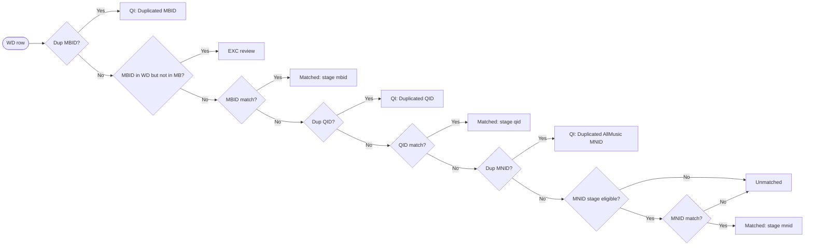

# emit_contributors.py README

This document covers the data pipeline and transformation behavior for emit_contributors.py.

## Pipeline Diagram

Legend:

- `QI:*` nodes route to `wikimedia_data_quality_issues` with the shown `reason`.
- `EXC review` routes to `EXCEPTION_wikidata_music_identity_mbid_not_in_musicbrainz_artists_review`.
- `Matched:*` nodes route into `contributors_unified` with `has_wikimedia_row=1` and match stage (`mbid`, `qid`, `mnid`).
- `Unmatched` routes to `unmatched_wikidata_music_identity`.
- `MNID stage eligible?` means Wikimedia row has `mbid_n IS NULL`.

## Stage Order (Stage-1 Contract)

1. MBID match first
2. QID match for remaining unmatched MB rows
3. MNID match for remaining unmatched MB rows (Wikimedia rows must have NULL MBID)

## AllMusic Allocation (Post Stage-1)

After Stage-1 MB<->WD matching is materialized into `contributors_unified`, a conservative AMG allocation phase runs:

1. Enrich existing unified rows by MNID
    - Target: rows in `contributors_unified` where `merge_key_allmusic_mnid` matches `amg.amg_artists.mnid`.
    - Effect: fills AMG display/contributor metadata on existing rows.
    - Provenance token: `mb_seed_amg_enriched_existing`.

2. Merge AMG remainder with Wikimedia residual by MNID
    - Source WD pool: current `unmatched_wikidata_music_identity`.
    - Source AMG pool: AMG rows not consumed by step 1.
    - Effect: inserts merged WD+AM rows into `contributors_unified`.
    - Provenance token: `wd_amg_merged_from_residual`.

3. Exact-name fallback for remaining MB-seeded rows
    - Target: remaining `contributors_unified` rows with `has_musicbrainz_row=1` and the relevant source side still absent.
    - Source WD pool: current `unmatched_wikidata_music_identity`.
    - Source AMG pool: AMG rows not consumed by steps 1 and 2.
    - Effect: exact caseless unique-name matches can enrich the same MB row from both residual sources when corroborated by WD gender and/or AMG birth year / active-era overlap.
    - Effect: removes consumed WD rows from `unmatched_wikidata_music_identity` and consumed AMG rows from `amg_remaining_t`.

4. Consume only matched WD residual rows
    - Effect: removes WD rows consumed in step 2 from `unmatched_wikidata_music_identity`.

5. Park remaining AMG residual rows
    - Destination: `unmatched_amg_artists`.
    - Effect: unmatched AMG rows are preserved for review.

6. Promote residual rows before final split
    - WD source: current `unmatched_wikidata_music_identity` rows are promoted as Wikimedia-only unified rows.
    - AMG source: current `amg_remaining_t` rows are promoted as AllMusic-only unified rows.
    - Effect: residual visibility tables remain intact for diagnostics, and residuals are also represented in unified outputs before the disambiguated/namesakes split.

## Persistent Output Tables

- contributors_unified
- wikimedia_data_quality_issues
- EXCEPTION_wikidata_music_identity_mbid_not_in_musicbrainz_artists_review
- unmatched_wikidata_music_identity
- unmatched_amg_artists

## Provenance Tokens (`contributors_unified.record_origin`)

- `mb_seed`
    - MB-seeded unified row from Stage-1 construction.
- `mb_seed_amg_enriched_existing`
    - Existing MB-seeded row enriched by AMG in post-stage allocation.
- `wd_amg_merged_from_residual`
    - New row inserted from WD residual + AMG remainder merge by MNID.

## Wikimedia Bucket Definitions

Every row from `wd.wikidata_music_identity` is routed into exactly one primary bucket.

1. Matched bucket
    - Destination: `contributors_unified` rows where `has_musicbrainz_row=1` and `has_wikimedia_row=1`
    - Rule: row participates in staged MB<->WD matching (`mb_wd_match_t`) via MBID, then QID, then MNID.

2. Data-quality bucket
    - Destination: `wikimedia_data_quality_issues`
    - Rule: row is quarantined by quality gates and excluded from matching.
    - Current reasons:
    - `Duplicated MBID` (applied in initial pre-match gate, before MBID matching)
    - `Duplicated QID` (applied after MBID matching and before QID/MNID matching)
    - `Duplicated AllMusic MNID` (applied after MBID/QID matching and before MNID matching)

3. Exception bucket
    - Destination: `EXCEPTION_wikidata_music_identity_mbid_not_in_musicbrainz_artists_review`
    - Rule: row has non-empty MBID, is not in data-quality bucket, and normalized MBID is absent from `musicbrainz_artists`.

4. Unmatched clean residual bucket
    - Destination: `unmatched_wikidata_music_identity`
    - Rule: row is not in data-quality bucket, not in exception bucket, and not matched in Stage-1 MB<->WD.
    - Post-allocation behavior: rows later merged with AMG by MNID are consumed from this table.

### Bucket precedence

1. Data-quality quarantine first:
    - initial pre-match gate: `Duplicated MBID`
    - post-MBID and pre-QID gate: `Duplicated QID`
    - post-QID and pre-MNID gate: `Duplicated AllMusic MNID`
2. Exception detection on remaining rows
3. Staged matching on eligible rows
4. Anything left goes to unmatched clean residual

### Accounting identity

For a completed run, population accounting should satisfy:

`COUNT(wd.wikidata_music_identity)`
`=` Matched
`+` Data-quality
`+` Exception
`+` Unmatched clean residual

If this delta is not zero, bucket construction logic regressed and should be investigated.
