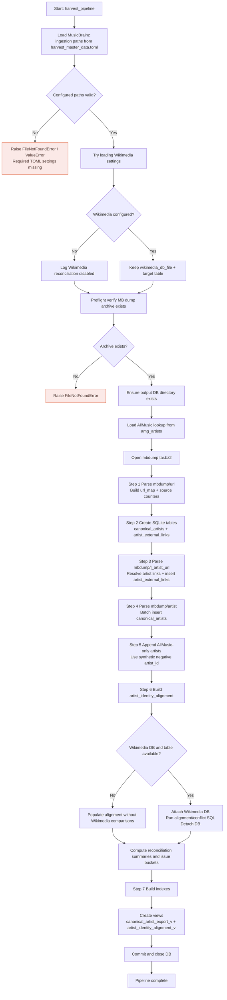
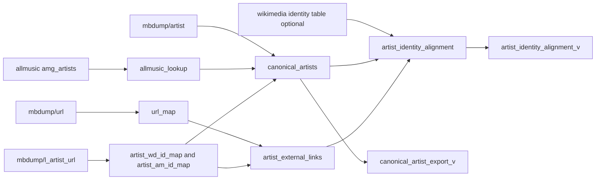

# harvest_mb_artists.py

Builds a canonical artist staging dataset by combining three external identity sources: MusicBrainz, AllMusic, and optionally Wikimedia. All output tables and views are fully rebuilt on each run.

---

## Data Sources

### 1. MusicBrainz dump archive — **required**

A local copy of `mbdump.tar.bz2` downloaded from the [MusicBrainz database download page](https://musicbrainz.org/doc/MusicBrainz_Database).

The pipeline reads three internal files from the archive:

| File | Content |
|---|---|
| `mbdump/url` | All URL entities (id, gid, url) |
| `mbdump/l_artist_url` | Artist-to-URL relationship rows |
| `mbdump/artist` | Full artist entity rows |

Configured via `[musicbrainz].dump_archive` in `harvest_master_data.toml`.

### 2. AllMusic metadata database — **optional**

A SQLite database (produced by a separate harvest step) containing a table named `amg_artists`:

| Column | Description |
|---|---|
| `mnid` | AllMusic numeric ID (e.g. `mn0000123456`) |
| `allmusic_artist` | Display name from AllMusic |
| `allmusic_url` | Canonical AllMusic artist URL |

Path resolved via `[allmusic].metadata_db`.

If not configured, the pipeline still resolves AllMusic MNIDs and URLs from the MusicBrainz dump. However:
- `allmusic_artist_name` will be `NULL` on all rows
- AllMusic-only artists (Step 5) are skipped entirely
- `aligns_with_allmusic` is `NULL` (unknown, not `0`) so no false conflicts are raised

### 3. Wikimedia identity database — **optional**

A SQLite database produced by `harvest_wikimedia.py`, containing a table named `wikidata_music_identity` (configurable):

| Column | Description |
|---|---|
| `item` | Wikidata QID URI (e.g. `http://www.wikidata.org/entity/Q42`) |
| `itemLabel` | Label string |
| `musicBrainzID` | MBID |
| `allMusicID` | AllMusic MNID |

If not configured, the pipeline completes without Wikimedia reconciliation: `has_wikimedia_row` will be `0` and all Wikimedia alignment/conflict fields will be `NULL`.

Configured via `[wikimedia].wikimedia_db`; table name via `[wikimedia].target_table`.

---

## Configuration (`harvest_master_data.toml`)

Add master-data settings to `harvest_master_data.toml`:

```toml
[musicbrainz]
dump_archive         = "/path/to/mbdump.tar.bz2"  # required
contributors_db      = "/path/to/output.db"        # optional — defaults to master-data.db

[allmusic]
metadata_db = "/path/to/allmusic.db"               # optional

[wikimedia]
wikimedia_db  = "/path/to/wikimedia.db"            # optional
target_table  = "wikidata_music_identity"      # optional — this is the default
```

---

## Output

All tables and views are written to the database resolved from `[musicbrainz].contributors_db`.

### Tables

#### `canonical_artists` — artist identity hub

One row per MusicBrainz artist, plus one row per AllMusic-only artist (synthetic negative `artist_id`).

| Column | Type | Notes |
|---|---|---|
| `artist_id` | INTEGER PK | MB internal ID or synthetic negative for AMG-only |
| `mbid` | TEXT | MusicBrainz UUID; NULL for AllMusic-only rows |
| `artist_name` | TEXT | Name from MB dump |
| `allmusic_artist_name` | TEXT | Name from AllMusic `amg_artists` |
| `begin_date_year/month/day` | INTEGER | |
| `end_date_year/month/day` | INTEGER | |
| `type` | INTEGER | MB artist type code |
| `area` | INTEGER | MB area code |
| `gender` | INTEGER | MB gender code |
| `disambiguation` | TEXT | |
| `ended` | INTEGER | 1 if the artist has ended |
| `wikidata_id` | TEXT | QID resolved via MB URL links |
| `allmusic_mnid` | TEXT | MNID resolved via MB URL links |
| `mbid_confirmation_source` | TEXT | |
| `wikidata_confirmation_source` | TEXT | |
| `allmusic_confirmation_source` | TEXT | |

#### `artist_external_links` — URL registry

All resolved external URLs for each artist, one row per `(artist_id, source, url)`.

| Column | Notes |
|---|---|
| `artist_id` | |
| `source` | `wikidata` \| `allmusic` \| `wikipedia` \| `discogs_artist` \| `discogs_release` \| `viaf` \| `isni` \| `rateyourmusic` \| `secondhandsongs` |
| `normalized_id` | Extracted identifier for the source |
| `url` | Original URL from MB dump |
| `language` | ISO code — Wikipedia rows only |
| `link_id` | MB `l_artist_url` link ID |

#### `artist_identity_alignment` — cross-source reconciliation

One row per canonical artist. Populated with or without Wikimedia.

| Column | Notes |
|---|---|
| `canonical_artist_id` | |
| `mbid`, `wikidata_id`, `allmusic_mnid` | Normalised identifiers |
| `has_musicbrainz_row` | 1 if artist has an MBID |
| `has_allmusic_row` | 1 if artist has an MNID |
| `has_wikimedia_row` | 1 if matched in Wikimedia table (0 if Wikimedia not available) |
| `aligns_with_allmusic` | 1/0/NULL — MNID resolves to an `amg_artists` name |
| `aligns_with_wikimedia` | 1/0/NULL — all non-NULL IDs agree in Wikimedia |
| `allmusic_wikimedia_aligned` | 1/0/NULL — QID + MNID agree in Wikimedia |
| `mbid_conflict` | 1 if Wikimedia disagrees on MBID |
| `qid_conflict` | 1 if Wikimedia disagrees on QID |
| `mnid_conflict` | 1 if Wikimedia disagrees on MNID |
| `conflict_reason` | Semicolon-delimited list of active conflict types |

### Views

| View | Description |
|---|---|
| `canonical_artist_export_v` | Flattened join of `canonical_artists` + preferred URLs from `artist_external_links`. Adds `wikidata_url`, `allmusic_url`. Suitable for parquet export. |
| `artist_identity_alignment_v` | `artist_identity_alignment` + computed `has_any_conflict` (1 if any conflict column is set). |

---

## Core Logic Flow



## Data Relationship View



## Notes

- Wikimedia reconciliation is optional: if not configured, alignment rows are still generated without Wikimedia cross-source checks.
- The script is designed for full rebuild behavior (drops and recreates output tables/views each run).
